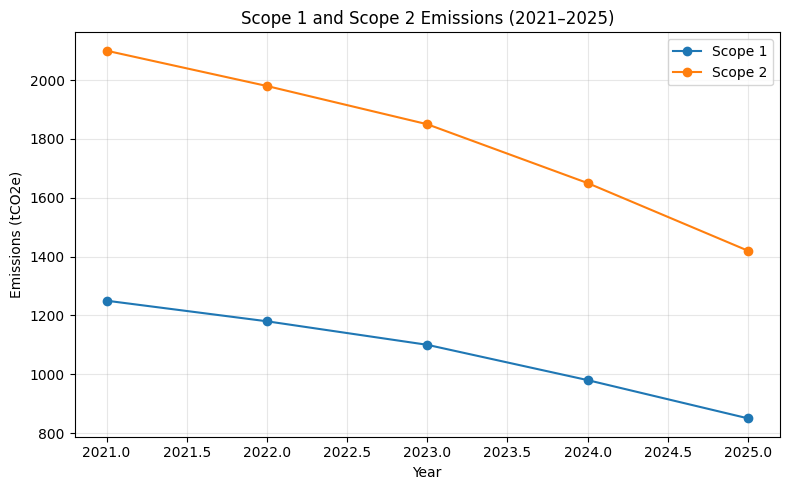
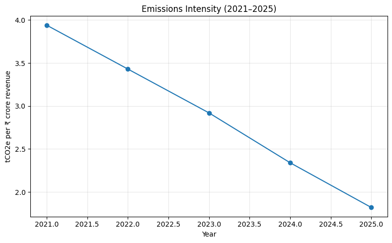

# Corporate Carbon Emissions Analysis

## Overview

This project analyzes corporate greenhouse gas emissions from 2021 to 2025, focusing on Scope 1 and Scope 2 emissions.

The objective is to understand how emissions changed over time and whether the company's emissions performance improved relative to business growth.

> Note: This project uses an illustrative dataset created for portfolio and learning purposes. The data does not represent a specific real-world company.

## Objectives

- Analyze Scope 1 and Scope 2 emissions
- Calculate total greenhouse gas emissions
- Analyze emissions intensity
- Compare emissions performance with revenue growth
- Identify key sustainability trends
- Develop data-driven ESG insights

## Data

The dataset contains annual information for 2021–2025:

- Scope 1 emissions
- Scope 2 emissions
- Total emissions
- Revenue
- Emissions intensity

Emissions are measured in tonnes of CO2 equivalent (tCO2e).

## Methodology

### 1. Total Emissions

Total emissions were calculated as:

Total Emissions = Scope 1 + Scope 2

### 2. Emissions Intensity

Emissions intensity was calculated as:

Emissions Intensity = Total Emissions / Revenue

The resulting indicator represents tonnes of CO2e emitted per ₹ crore of revenue.

## Key Findings

### Emissions decreased

Total emissions declined from 3,350 tCO2e in 2021 to 2,270 tCO2e in 2025.

This represents an approximately 32% reduction.

### Emissions intensity improved

Emissions intensity decreased from approximately 3.94 tCO2e per ₹ crore of revenue in 2021 to 1.82 tCO2e per ₹ crore in 2025.

This represents an approximately 54% improvement.

### Business growth continued

Revenue increased from ₹850 crore in 2021 to ₹1,250 crore in 2025.

This indicates that the company experienced revenue growth while reducing its emissions intensity.

## Visualizations

### Scope 1 and Scope 2 Emissions

### Emissions Intensity

## ESG Interpretation

The analysis indicates a positive trend in operational carbon performance.

Both Scope 1 and Scope 2 emissions declined during the five-year period, while revenue increased. The reduction in emissions intensity suggests that the company's economic activity became less carbon-intensive over time.

Potential areas for further investigation include:

- Renewable electricity adoption
- Energy efficiency initiatives
- Operational decarbonization
- Electricity consumption trends
- Changes in production or business activity
- Scope 3 emissions
- Science-based emissions reduction targets

## Tools & Skills

- ESG Analysis
- Carbon Emissions Analysis
- Scope 1 & Scope 2
- Emissions Intensity
- Microsoft Excel
- Data Analysis
- Data Visualization
- Sustainability Reporting

## Limitations

This analysis focuses only on Scope 1 and Scope 2 emissions.

Scope 3 emissions, which may represent a significant portion of an organization's overall value-chain emissions, are not included.

The dataset is illustrative and should not be interpreted as reported emissions from a real company.

## Future Improvements

Future versions of this project could include:

- Scope 3 emissions analysis
- GHG Protocol category analysis
- Renewable energy analysis
- Carbon reduction targets
- Year-over-year emissions change
- ESG KPI dashboard
- Python-based analysis
- Interactive Power BI dashboard
